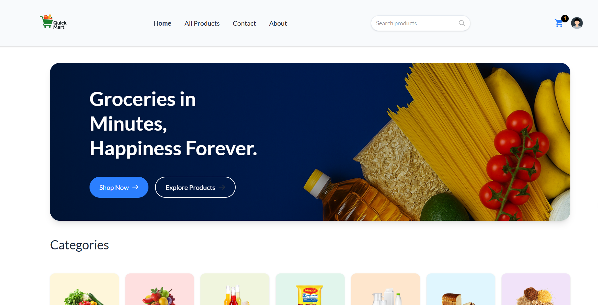
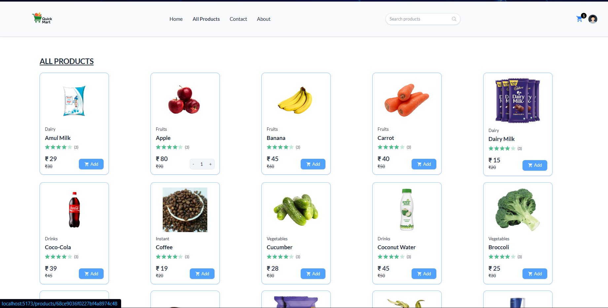
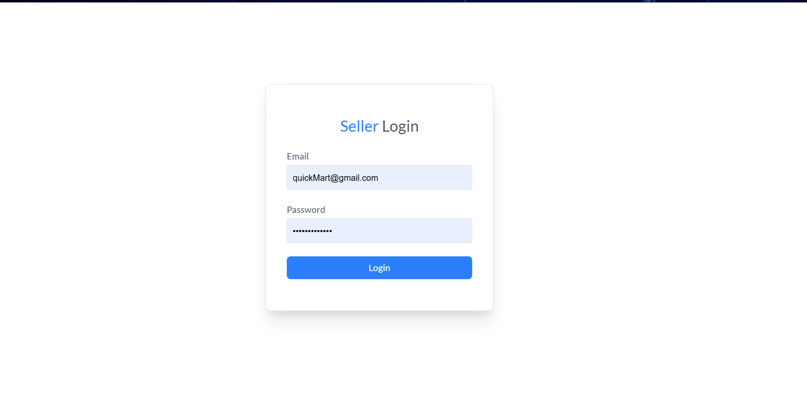
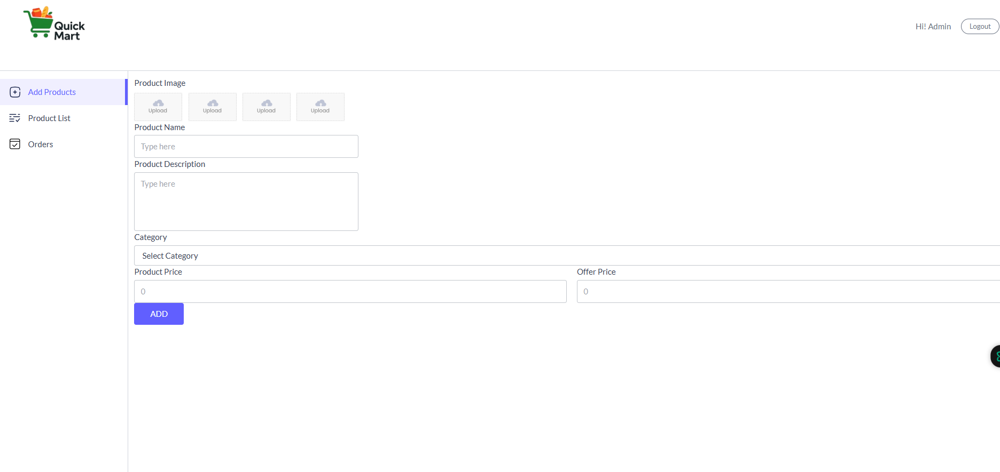

# QuickMart Grocery(MADE BY SUMIT)

QuickMart Grocery is a full-stack web application for online grocery shopping. It features a modern frontend built with React and Vite, and a robust backend using Node.js and Express. Users can browse products, manage their cart, place orders, and sellers can manage inventory.

<!--  -->



## Features

- User authentication and authorization
- Product browsing and search
- Cart management
- Order placement and tracking
- Seller dashboard for inventory management (<http://localhost:5173/seller>)
- Address management
- Responsive UI

## Tech Stack

- **Frontend:** React, Vite, CSS
- **Backend:** Node.js, Express
- **Database:** MongoDB
- **Cloudinary:** Image uploads
- **stripe:** for payment

## Getting Started

### Prerequisites

- Node.js
- npm
- MongoDB (local or Atlas)

### Backend Setup

1. Navigate to the `Backend` folder:

   ```sh
   cd Backend
   ```

2. Install dependencies:

   ```sh
   npm install
   ```

3. Configure environment variables in `.env` (see `configs/connectDB.js` for details).

4. Start the backend server:

   ```sh
   npm start
   ```

### Frontend Setup

1. Navigate to the `Frontend` folder:

   ```sh
   cd Frontend
   ```

2. Install dependencies:

   ```sh
   npm install
   ```

3. Start the frontend development server:

   ```sh
   npm run dev
   ```

## Folder Structure

```plaintext
Backend/
   controllers/
   models/
   routes/
   configs/
   middlewares/
Frontend/
   src/
   public/
```

## Screenshots

Below are sample images of the application:

## Seller Profile

The Seller Profile allows sellers to manage their products, view orders, and update their information. Below are sample seller images:




### Home Page


### Product Page


## License

This project is licensed under the MIT License.

---

For any queries or contributions, feel free to open an issue or pull request.
